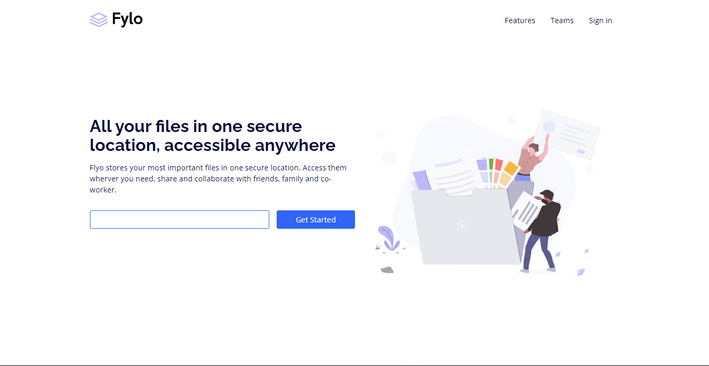

# Frontend Mentor - Huddle landing page with curved sections solution

This is a solution to the [Fylo landing page with two column layout challenge on Frontend Mentor](https://www.frontendmentor.io/challenges/fylo-landing-page-with-two-column-layout-5ca5ef041e82137ec91a50f5). Frontend Mentor challenges help you improve your coding skills by building realistic projects.

## Table of contents

- [Overview](#overview)
  - [The challenge](#the-challenge)
  - [Screenshot](#screenshot)
  - [Links](#links)
- [My process](#my-process)
  - [Built with](#built-with)
  - [What I learned](#what-i-learned)
  - [Continued development](#continued-development)
- [Author](#author)
- [Acknowledgments](#acknowledgments)

## Overview

This project is made using the VueJS along with tailwind css. It provide the concept landing page of the huddle.

### The challenge

Users should be able to:

- View the optimal layout for the site depending on their device's screen size
- See hover states for all interactive elements on the page

### Screenshot

### Links

- Solution URL: [Github](https://github.com/munezerobagira/Fylo-basic)
- Live Site URL: [Click here](https://fylo-basic.vercel.app/)

## My process

### Built with

- Semantic HTML5 markup
- CSS custom properties
- Flexbox
- [VueJS](https://vue.org/) - JS library
- [tailwindcss](https://tailwindcss.com/) - CSS Famewrok
- [ViteJS](https://vitejs.dev/)

### What I learned

- Tailwind Flexbox
- Tailwind Configuration

### Continued development

On way to my second challenge in #100DaysOfCode

## Author

- Website - [Link](munezerobagira.github.io)
- Frontend Mentor - [@munezerobagira](https://www.frontendmentor.io/profile/munezerobagira)
- Twitter - [@SosteneMunezero](https://www.twitter.com/SosteneMunezero)

## Acknowledgments

I want to all my wonderful family and friends for their endless motivation
